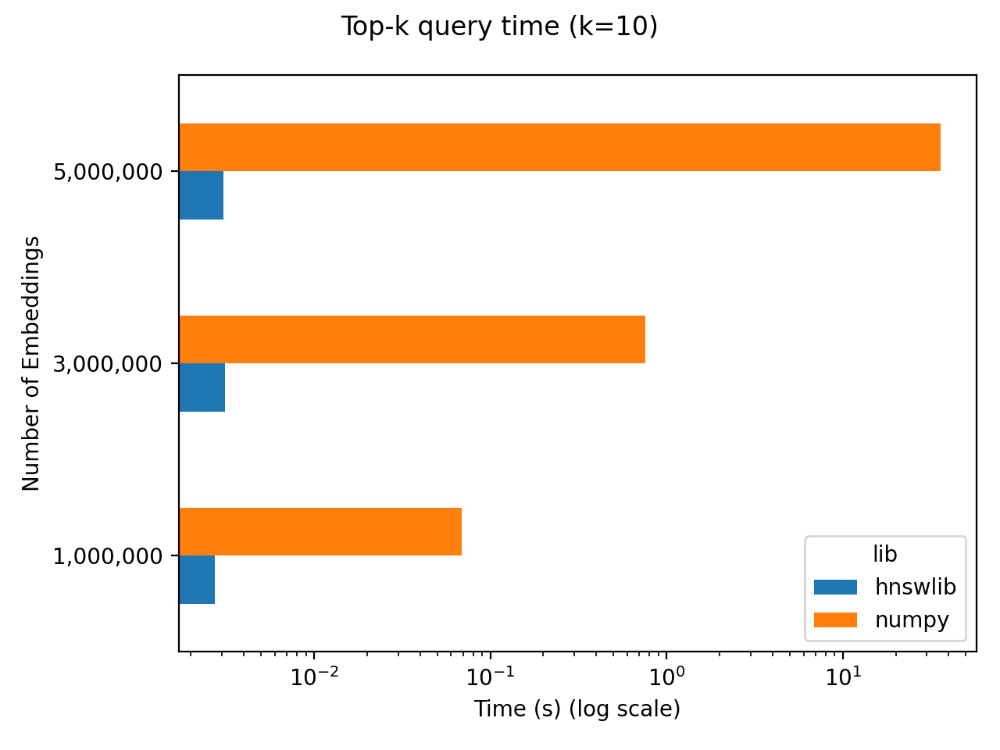

# nn-vs-ann

Nearest Neighbors vs Approximate Nearest Neighbors

This repo runs a quick benchmark for calculating nearest neighbors for embeddings / representations / vectors / latent factors / whatever you want to call them now. This benchmark pits an exact nearest neighbors calculation using [numpy](https://numpy.org/) against an approximate nearest neighbors calculation using [hnswlib](https://github.com/nmslib/hnswlib). The main takeaway is that exact nearest neighbors calculations scale poorly, but it depends on what scale you need. For a million documents and 1536-dimensional embeddings, the top 10 nearest neighbor embeddings can be found in ~50 ms with hnswlib.

## Benchmark

Time in seconds.

| num_embeddings |    hnswlib |    numpy |
| :------------- | ---------: | -------: |
| 1,000,000      | 0.00274306 | 0.068801 |
| 3,000,000      | 0.00312312 | 0.761944 |
| 5,000,000      |  0.0030509 |  35.8056 |



System Details:

- M2 Macbook Pro. 32 GB DDR4-3200 RAM.

## Usage

To run the benchmarks locally, clone this repo and then use [poetry](https://python-poetry.org/docs/) to install this package by running the following command in the root directory of this repo.

```commandline
poetry install
```

Run the benchmarks by running

```commandline
python -m nn_vs_ann.benchmark
```

This will save a file to `/assets/results.csv`. You can generate the plot in this README by running

```commandline
python -m nn_vs_ann.viz
```

This will save a plot to `/assets/results.png`.

Lastly, you can update this here README with your benchmark results by running

```commandline
python -m nn_vs_ann.gen
```
